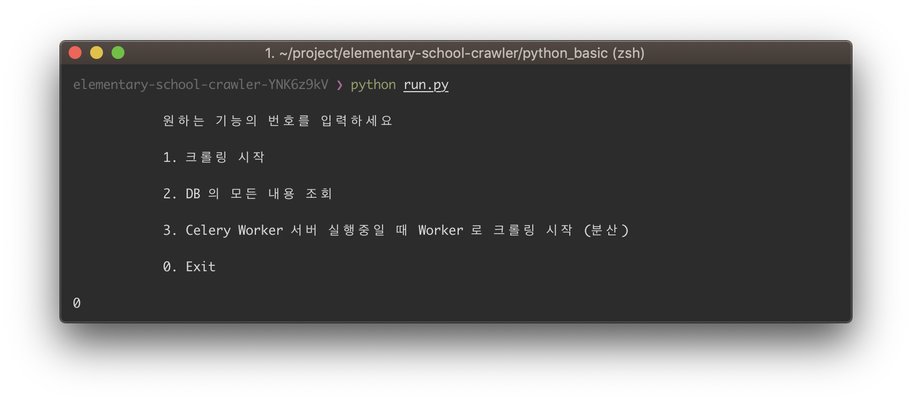

# Basic python school crawler

테스트 환경 mac os mojave 10.14.4 / python 3.7.1

## Run Broker Server

```bash
>> docker run -d -p 6379:6379 redis
```

## Run Celery Server

```bash
~/elementary-school-crawler/python_basic/
>> celery -A tasks worker -l info -B
```

## Run Process

```bash
~/elementary-school-crawler/python_basic/
>> python run.py
```



## Crawling Schedules

Celery & Redis server 실행중일 때만 작동한다.

- AM 09:00
- PM 14:00
- PM 18:00

## Library

- requests
- bs4.beautifulsoup4 / lxml
- celery redis
- sqlite3
